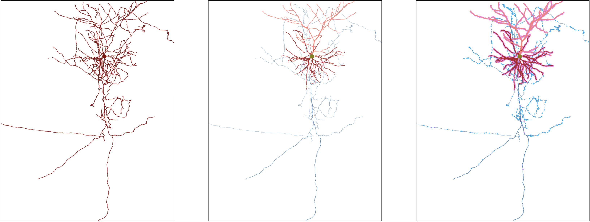

Skeleton Plot
=================================================


Skeleton keys is a plotting tool for neuronal skeletons. 

## If you have an object with vertices and edges, or vertices and edges:
use skeleton_plot.plot_tools.plot_verts. This is how the leftmost skeleton plot above was plotted:

```
skeleton_plot.plot_tools.plot_verts(vertices, edges,  ax = ax[0], 
    invert_y=True, line_width = 2.2, color = 'maroon', plot_soma = True)
```
note: more arguments are available to be used with this function such as color and radius maps 

## If you have an meshparty skeleton that you want to plot:
use skeleton_plot.plot_tools.plot_skel. This is how the skeleton plot above in the middle was generated:

```
skeleton_plot.plot_tools.plot_skel(sk,  ax = ax[1], pull_radius = True, 
    pull_compartment_colors = True, invert_y=True, plot_soma = True, 
    line_width = 3, color = 'darkslategray') 
``` 
note: in order to use pull_radius argument, store the radius information in sk.vertex_properties['radius'] via 
```
sk.vertex_properties['radius'] = **series with radius of each node of same length as sk.vertices**
```

## If you have a meshparty meshwork:
use skeleton_plot.plot_tools.plot_mw_skel. This is how the skeleton plot on the right was generated:

```
skeleton_plot.plot_tools.plot_mw_skel(mw, ax = ax[2], pull_radius = True,
    invert_y=True, line_width = 5, plot_soma = True,
    pull_compartment_colors = True, plot_presyn = True,
    plot_postsyn = True)
```
note: in order to use pull_radius argument, you should have:
- the appropriate root/soma location stored in mw.skeleton.root
- basal dendrite labels stored in mw.anno[basal_table]
- apical labels stored in mw.anno[apical_table]
- axon labels stored in  mw.anno[axon_table]

you may also want to plot synapses, in which case they must be stored in 
- mw.anno.pre_syn['pre_pt_position']
- mw.anno.post_syn['post_pt_position']


